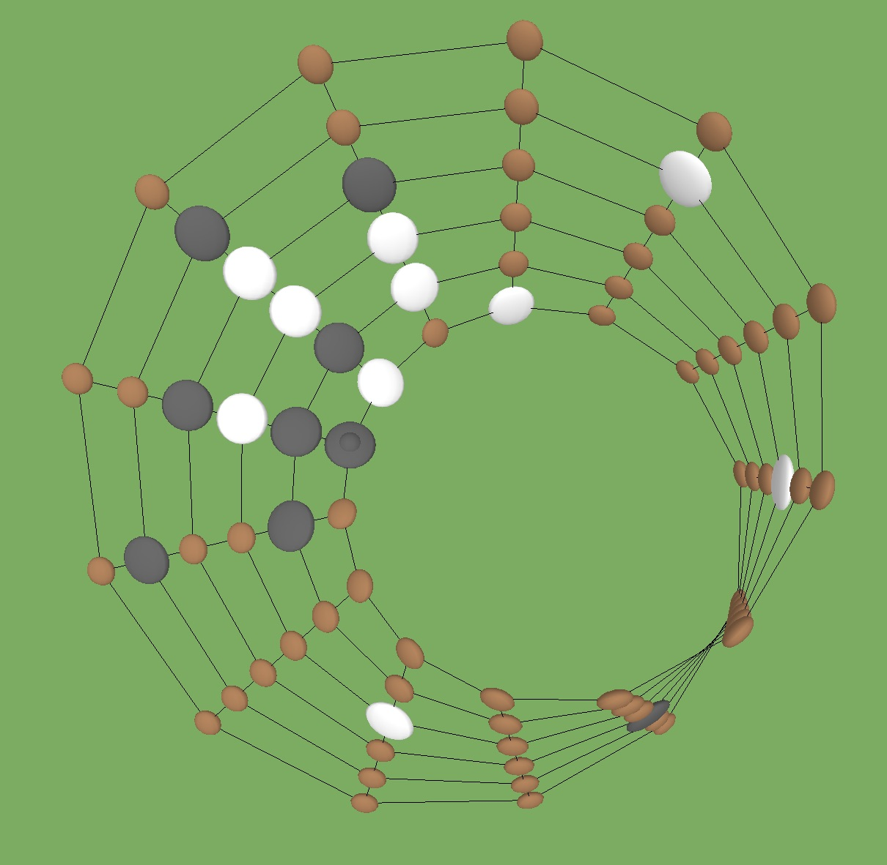

# Freed Games

Games freed of their traditional dimensionality. 

## Freed Go: 

https://leweyg.github.io/FreedGames/FreedGo/

Traditional <a href="https://en.wikipedia.org/wiki/Go_(game)">Game of Go</a> adapted to numerous 3 dimensional terrains such as a mobius strip and torus. Includes realtime cloud-based multiplayer and save games.

## Shuzzle: 

NOTE: Not finished...

https://leweyg.github.io/FreedGames/Shuzzle/

Based on the original Freed Series: 
http://www.lewcid.com/lg/lc/freed.html

## Source Code

These projects [exist as pure client-side JavaScript](docs/), servable from a static server (and using an embedded [three.js](https://threejs.org/) render layer). They connect to a Google server for cloud storage and multiplayer room management.

The original [Freed Series](http://www.lewcid.com/lg/lc/freed.html) was written in C++ over OpenGL and GLUT. This project includes their ([C++ source code](cpp/)), those level designs were exported as the [v1 JSON descriptions](v1/), and imported into the web versions.
